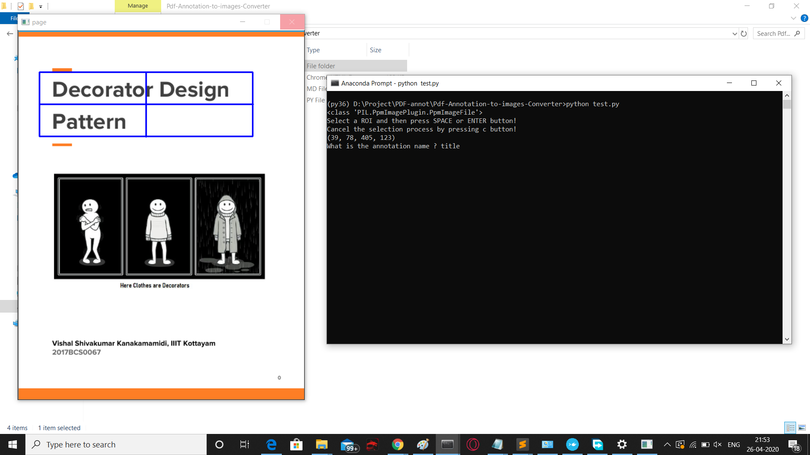

# Pdf-Annotation-to-Images-Converter
# Introduction
  ●	Here I have implemented a pdf annotator which takes annotations in the form of rectangular boxes and saves it as an image file  
  ●	You can make the annoation boxes by just pressing the left mouse click.  
# Environment
  ●	Python 3.6 Environment in Anaconda  
  ●	The libraries installed here are - pdftoimage, pillow, opencv-python, numpy 
  
# Implementation
  ●	python test.py (Mention the filename inside the code in place of Dec.pdf)  
  ●	Make a rectangular box around the section to be annotated by pressing the left mouse button and dragging it and press SPACE to select the annotation.  
  ●	Then go to the terminal and write the annotation name in it and press ENTER 
  ●	Repeat the above steps until all annotations are selected 
  ●	Press c to proceed to next page.  
  
    
   
  You can also refer to this video in youtube for implementation - https://youtu.be/S54008QM6tw
